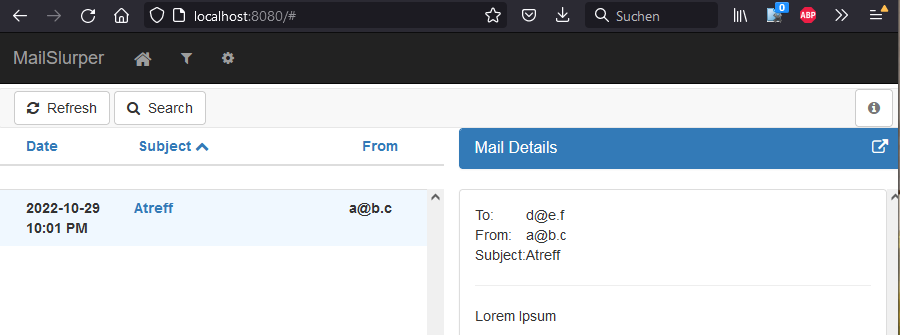

# mailslurper
testing mailslurper docker + small app sending emails

## Docker

Testing with this image: https://hub.docker.com/r/adampresley/mailslurper

```docker
docker pull adampresley/mailslurper
```

```docker
docker run -p 8080:8080 -p 8085:8085 -p 2500:2500 adampresley/mailslurper --name mailslurper
```

Opening the web console: <http://localhost:8080/>

## Sending an email

### Python

Trying to write a small Python programm. Following this guide: [Sending Emails With Python](https://realpython.com/python-send-email)

#### Setting up a Local SMTP Server

```python
python -m smtpd -c DebuggingServer -n localhost:1025
```

Example output

```python
---------- MESSAGE FOLLOWS ----------
Date: Sat, 29 Oct 2022 16:52:15 +0200 (CEST)
From: a@b.c
To: d@e.f
Message-ID: <352359770.0.1667055140263@locahost>
Subject: Atreff
MIME-Version: 1.0
Content-Type: text/plain; charset=UTF-8
Content-Transfer-Encoding: 7bit
X-Peer: 127.0.0.1

Lorem Ipsum
------------ END MESSAGE ------------
```

### testing

Starting `src\main\java\daniel\w\f\App.java`
And receiving emails with `DebuggingServer`

### Emails recieved by MailSlurper

MailSlurper locally running as Docker Container, listening on port 2500.


## Mailslurper Docker Image

<https://www.mailslurper.com/>

Download from <https://github.com/mailslurper/mailslurper/releases> -> mailslurper-1.14.1-linux.zip

```shell
wget https://github.com/mailslurper/mailslurper/releases/download/1.14.1/mailslurper-1.14.1-linux.zip
```

Maybe adjust to be more generic...

```shell
GH_USER=REPLACE_WITH_USER \
GH_REPO=REPLACE_WITH_REPO \
GH_BRANCH=REPLACE_WITH_BRANCH \
wget https://github.com/${GH_USER}/${GH_REPO}/archive/refs/tags/${GH_BRANCH}.zip \
-O "${GH_REPO}-${GH_BRANCH}.zip" && \ 
unzip ./"${GH_REPO}-${GH_BRANCH}.zip" && \
rm ./"${GH_REPO}-${GH_BRANCH}.zip"
```

<https://hub.docker.com/_/alpine/tags>

```docker
docker pull alpine:3.16.2
docker build . -t test-mailslurpe
```
